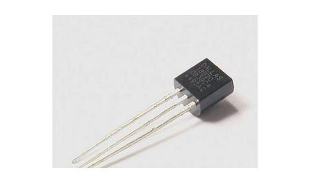
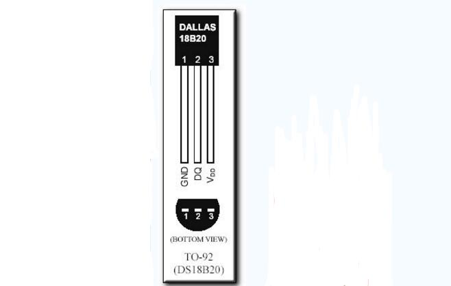

# DS18B20 数字温度传感器

## DS18B20概述

DS18B20是常用的数字温度传感器，具有体积小，硬件开销低，抗干扰能力强，精度高的特点。DS18B20数字温度传感器接线方便，封装成后可应用于多种场合，如管道式，螺纹式，磁铁吸附式，不锈钢封装式，型号多种多样，有LTM8877，LTM8874等等。

主要根据应用场合的不同而改变其外观。封装后的DS18B20可用于电缆沟测温，高炉水循环测温，锅炉测温，机房测温，农业大棚测温，洁净室测温，弹药库测温等各种非极限温度场合。耐磨耐碰，体积小，使用方便，封装形式多样，适用于各种狭小空间设备数字测温和控制领域。

## DS18B20的性能

1. 独特的单线接口方式，DS18B20在与微处理器连接时仅需要一条口线即可实现微处理器与DS18B20的双向通讯。
2. 测温范围－55℃～+125℃，固有测温误差（注意，不是分辨率，这里之前是错误的）1℃。
3. 支持多点组网功能，多个DS18B20可以并联在唯一的三线上，最多只能并联8个，实现多点测温，如果数量过多，会使供电电源电压过低，从而造成信号传输的不稳定。
4. 工作电源：3.0~5.5V/DC（可以数据线寄生电源）
5. 在使用中不需要任何外围元件
6. 测量结果以9~12位数字量方式串行传送
7. 不锈钢保护管直径Φ6
8. 适用于DN15~25，DN40~DN250各种介质工业管道和狭小空间设备测温
9. 标准安装螺纹M10X1，M12X1.5，G1/2”任选
10. PVC电缆直接出线或德式球型接线盒出线，便于与其它电器设备连接。

## DS18B20引脚图及功能

DS18B20内部结构主要由四部分组成：64位光刻ROM、温度传感器、非挥发的温度报警触发器TH和TL、配置寄存器。

1. GND 为电源地
2. DQ 为数字信号输入/输出
3. VDD 为外接供电电源输入端（在寄生电源接线方式时接地）

## DS18B20工作原理

DS18B20的读写时序和测温原理与DS1820相同，只是得到的温度值的位数因分辨率不同而不同，且温度转换时的延时时间由2s减为750ms。DS18B20测温原理如图3所示。图中低温度系数晶振的振荡频率受温度影响很小，用于产生固定频率的脉冲信号送给计数器1。高温度系数晶振随温度变化其振荡率明显改变，所产生的信号作为计数器2的脉冲输入。计数器1和温度寄存器被预置在-55℃所对应的一个基数值。计数器1对低温度系数晶振产生的脉冲信号进行减法计数，当计数器1的预置值减到0时，温度寄存器的值将加1，计数器1的预置将重新被装入，计数器1重新开始对低温度系数晶振产生的脉冲信号进行计数，如此循环直到计数器2计数到0时，停止温度寄存器值的累加，此时温度寄存器中的数值即为所测温度。斜率累加器用于补偿和修正测温过程中的非线性，其输出用于修正计数器1的预置值。

###  初始化

单总线上的所有处理均从初始化开始。

###  ROM 操作指令

总线主机检测到DSl820的存在便可以发出ROM操作命令之一这些命令如

| -指令-                  | -代码- |
| ----------------------- | ------ |
| Read ROM(读 ROM)        | 33H    |
| Match ROM (匹配 ROM)    | 55H    |
| Skip ROM (跳过 ROM)     | CCH    |
| Search ROM (搜索 ROM)   | F0H    |
| Alarm search (告警搜索) | ECH    |

### 存储器操作命令

| 指令                             | 代码 |
| -------------------------------- | ---- |
| Write Scratchpad (写暂存存储器)  | 4EH  |
| Read Scratchpad (读暂存存储器)   | BEH  |
| Copy Scratchpad (复制暂存存储器) | 48H  |
| Convert Temperature (温度变换)   | 44H  |
| Recall EPROM (重新调出)          | B8H  |
| Read Power supply (读电源)       | B4H  |

### 时序

主机使用时间隙(time slots)来读写DSl820的数据位和写命令字的位

#### 初始化

时序见图2.25-2主机总线to时刻发送一复位脉冲(最短为480us的低电平信号)接着在tl时刻释放总线并进入接收状态DSl820在检测到总线的上升沿之后等待15-60us接着DS1820在t2时刻发出存在脉冲(低电平持续60-240 us)如图中虚线所示
以下子程序在MCS51仿真机上通过其晶振为12M.初始化子程序

