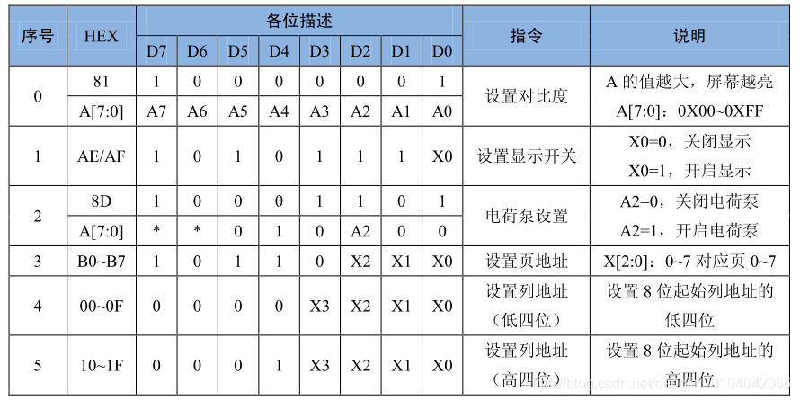

# SSD1306-OLED驱动

**OLED**，即有机发光二极管，自发光，不需要背光源，被认为是下一代的平面显示器新兴应用技术。

## 基础指令

### 1. 页地址模式下设置列起始地址低位(Set Lower Column Start Address For Page Addressing Mode)(00h~0Fh)

此指令用于在页地址模式下设置GDDRAM的列起始地址(8位)的低4位, 页地址会在数据访问后递增

### 2.页地址模式下设置列起始地址高位(Set Higher Column Start Address For Page Addressing Mode)(10h~1Fh)

此指令用于在页地址模式下设置GDDRAM的列起始地址(8位)的高4位, 页地址会在数据访问后递增

### 3.设置内存地址模式(Set Memory Addressing Mode)(20h)

在SSD1306中有三种地址模式: 页地址模式, 水平地址模式和垂直地址模式, 此命令用于将地址模式设置为以上三种之一
'COL'的含义是GDDRAM列(column)

页地址模式(A[1:0]=10b)
当处于此模式时, 在GDDRAM访问后(读/写), 列地址指针将自动增加1。如果列地址指针到达列终止地址, 列地址指针将复位到列起始地址, 但页地址指针不会改变。
为了访问GDDRAM中下一页的内容, 用户必须设置新的页地址和列地址。页地址模式下页以及列地址指针的行为如下图所示


通常在页地址模式下访问GDDRAM, 需要如下步骤来定义起始RAM访问指针指向:
-通过命令(B0h-B7h)设置目标显示位置页起始地址
-通过命令(00h-0Fh)设置列起始地址低位
-通过命令(10h-1Fh)设置列起始地址高位

例如, 如果页地址是B2h, 列地址低位是03h, 列地址高位是10h, 起始列将为PAGE2的SEG3, GDDRAM访问指针的指向如下图所示


水平地址模式(A[1:0]=00b)
当处于此模式时, 在GDDRAM访问后(读/写), 列地址指针将自动增加1。如果列地址指针到达列终止地址, 列地址指针将复位到列起始地址, 且页地址指针将自动增加1。
水平地址模式下页以及列地址指针的行为如下图所示, 如果列地址指针和页地址指针都到达各自的终止地址时, 他们都将复位到各自的起始地址。(图中虚线)


垂直地址模式(A[1:0]=01b)
当处于此模式时, 在GDDRAM访问后(读/写), 页地址指针将自动增加1。如果页地址指针到达页终止地址, 页地址指针将复位到页起始地址, 且列地址指针将自动增加1。
垂直地址模式下页以及列地址指针的行为如下图所示, 如果列地址指针和页地址指针都到达各自的终止地址时, 他们都将复位到各自的起始地址。(图中虚线)


通常在(垂直/水平)地址模式下访问GDDRAM, 需要如下步骤来定义起始RAM访问指针指向:
-通过命令(21h)设置目标显示位置列起始地址以及列终止地址
-通过命令(22h)设置目标显示位置页起始地址以及页终止地址

### 4.设置列地址(Set Column Address)(21h)

此指令用于设置GDDRAM的列起始地址和列结束地址, 并使列地址指针(指向GDDRAM中当前访问的列地址)指向列起始地址。
若内存地址模式为水平地址模式, 在访问一列数据后, 列地址指针将增加到下一个列地址。当结束访问终止列地址时, 列地址指针将复位至列起始地址, 且行地址指针将增加到下一行。

## 指令例子

常用指令列表：



```c
/* Init LCD */
SSD1306_WRITECOMMAND(0xAE); //display off 关闭 OLED
SSD1306_WRITECOMMAND(0x20); //Set Memory Addressing Mode   
SSD1306_WRITECOMMAND(0x10); //00,Horizontal Addressing Mode;01,Vertical Addressing Mode;10,Page Addressing Mode (RESET);11,Invalid
SSD1306_WRITECOMMAND(0xB0); //Set Page Start Address for Page Addressing Mode,0-7
SSD1306_WRITECOMMAND(0xC8); //Set COM Output Scan Direction
SSD1306_WRITECOMMAND(0x00); //---set low column address
SSD1306_WRITECOMMAND(0x10); //---set high column address
SSD1306_WRITECOMMAND(0x40); //--set start line address
SSD1306_WRITECOMMAND(0x81); //--set contrast control register
SSD1306_WRITECOMMAND(0xFF);
SSD1306_WRITECOMMAND(0xA1); //--set segment re-map 0 to 127
SSD1306_WRITECOMMAND(0xA6); //--set normal display
SSD1306_WRITECOMMAND(0xA8); //--set multiplex ratio(1 to 64)
SSD1306_WRITECOMMAND(0x3F); //
SSD1306_WRITECOMMAND(0xA4); //0xa4,Output follows RAM content;0xa5,Output ignores RAM content
SSD1306_WRITECOMMAND(0xD3); //-set display offset
SSD1306_WRITECOMMAND(0x00); //-not offset
SSD1306_WRITECOMMAND(0xD5); //--set display clock divide ratio/oscillator frequency
SSD1306_WRITECOMMAND(0xF0); //--set divide ratio
SSD1306_WRITECOMMAND(0xD9); //--set pre-charge period
SSD1306_WRITECOMMAND(0x22); //
SSD1306_WRITECOMMAND(0xDA); //--set com pins hardware configuration
SSD1306_WRITECOMMAND(0x12);
SSD1306_WRITECOMMAND(0xDB); //--set vcomh
SSD1306_WRITECOMMAND(0x20); //0x20,0.77xVcc
SSD1306_WRITECOMMAND(0x8D); //--set DC-DC enable
SSD1306_WRITECOMMAND(0x14); //
SSD1306_WRITECOMMAND(0xAF); //--turn on SSD1306 panel
```

